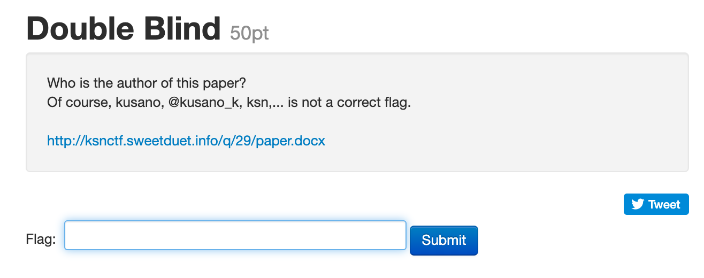
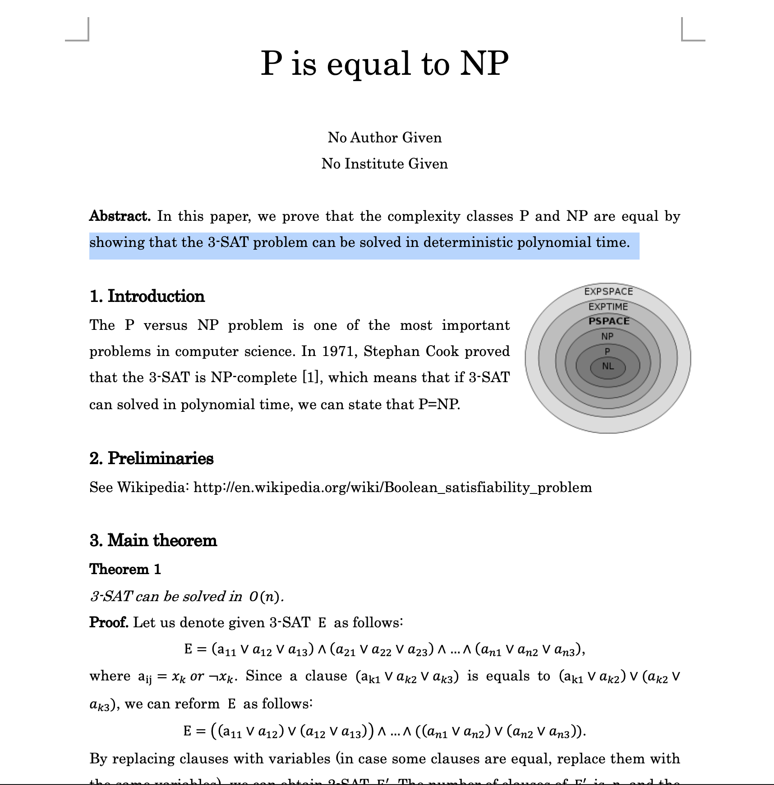
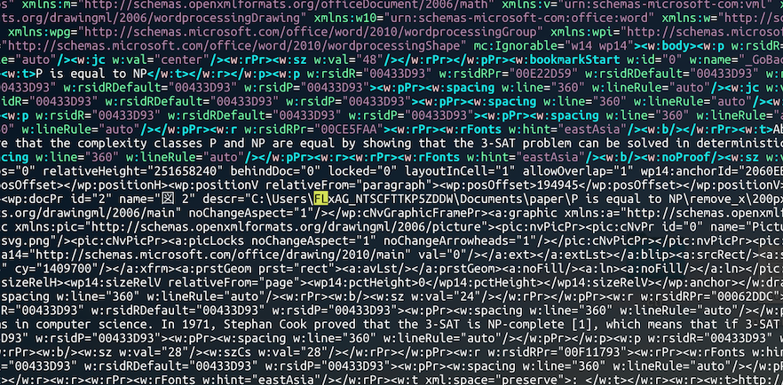
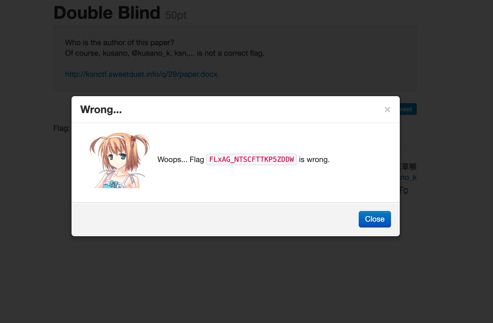
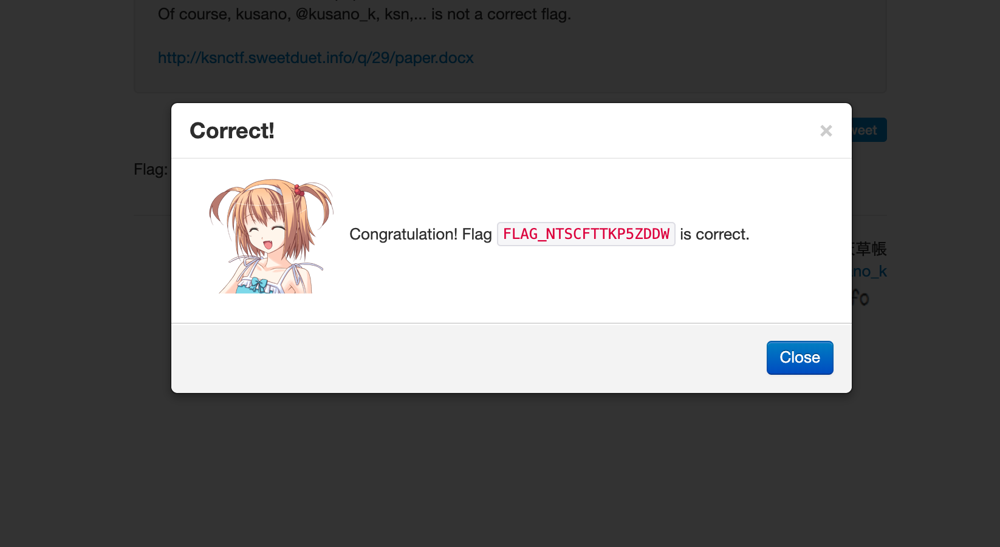

---?color=#FDF5E6

IS41　セキュリティ課題発表<br><br>
『CFT』<br><br>
チームさかい
---?color=#FDF5E6
### 「 CTF 」とは 
<br>
- Capture The Flag（旗取りゲーム）の略<br><br>
- 情報セキュリティの技術を競う競技・ゲーム<br><br>
- 隠された答え（Flag）をセキュリティスキルを用いて探し、答えをサーバへ送信するクイズ形式が多い

+++?color=#FDF5E6

### 基本ルール
<br>
制限時間以内に得点を多く獲得したチームが勝利
- 制限時間：だいたい12h~48h(大会による)
- 検索 : オンライン，オフライン問わず可

+++?color=#FDF5E6

### 禁止事項
<br>
- 競技時間内の他チームのとのフラグ・解法の共有

---?color=#343434 
### 主な出題分野
<br>

@color[#FF8C00](・Reverse engineering, Binary) <br> 
@color[#FF8C00](・Network)<br>
@color[#FF8C00](・Forensics) <br>
@color[#FF8C00](・Pwn -脆弱性調査- ) <br>
@color[#FF8C00](・Web) <br>
@color[#FF8C00](・Cipher -暗号-) <br>
@color[#FF8C00](・programming)

---?color=#343434 
### Forensics
<br>

@color[#EEE](物理メモリのイメージファイルを解析し，必要な情報を得ること)<br> <br>
@color[#EEE](例えば犯罪捜査で)<br>
@color[#EEE](● 消えたファイルを特定) <br> 
@color[#EEE](● 一部が壊れたデータの復元) <br> 
@color[#EEE](● ファイルのタイムスタンプを調査) <br> 

---?color=#343434 
### Pwn
<br>

@color[#EEE](プログラムの脆弱性を突いてフラグを獲得する問題) <br> <br> 
@color[#EEE](どうやって解くの？) <br><br> 
@color[#EEE](1, プログラムは配布されるので、手元で解析) <br> 
@color[#EEE](2, 解析結果からファイルへアクセスする処理を行うコードを作成) <br> 
@color[#EEE](3, 実際に攻撃をしてフラグをゲット！) <br> 

---?color=#343434 
### 試しに解いてみよう

---?color=#343434




---?color=#343434



---?color=#343434

```
$ mv paper.docx paper.zip
$ mkdir ./ctf && unzip paper.zip -d ./ctf
$ cd ctf
$ ls

total 24
drwxr-xr-x   7 shunsuke  staff   224B Sep 25 16:28 .
drwx------+ 22 shunsuke  staff   704B Sep 25 18:24 ..
-rw-r--r--@  1 shunsuke  staff   6.0K Sep 25 16:28 .DS_Store
-rw-r--r--@  1 shunsuke  staff   2.4K Jan  1  1980 [Content_Types].xml
drwxr-xr-x@  3 shunsuke  staff    96B Sep 25 16:23 _rels
drwxr-xr-x@  4 shunsuke  staff   128B Sep 25 16:23 docProps
drwxr-xr-x@ 19 shunsuke  staff   608B Sep 25 16:23 word
```

---?color=#343434

```
$ cd word
$ ll
total 256
drwxr-xr-x@ 3 shunsuke  staff    96B Sep 25 16:23 _rels
-rw-r--r--@ 1 shunsuke  staff    42K Jan  1  1980 document.xml
-rw-r--r--@ 1 shunsuke  staff   1.4K Jan  1  1980 endnotes.xml
-rw-r--r--@ 1 shunsuke  staff   2.0K Jan  1  1980 fontTable.xml
-rw-r--r--@ 1 shunsuke  staff   1.2K Jan  1  1980 footer1.xml
-rw-r--r--@ 1 shunsuke  staff   1.2K Jan  1  1980 footer2.xml
-rw-r--r--@ 1 shunsuke  staff   1.2K Jan  1  1980 footer3.xml
-rw-r--r--@ 1 shunsuke  staff   1.4K Jan  1  1980 footnotes.xml
-rw-r--r--@ 1 shunsuke  staff   1.2K Jan  1  1980 header1.xml
-rw-r--r--@ 1 shunsuke  staff   1.2K Jan  1  1980 header2.xml
-rw-r--r--@ 1 shunsuke  staff   1.2K Jan  1  1980 header3.xml
drwxr-xr-x@ 3 shunsuke  staff    96B Sep 25 16:23 media
-rw-r--r--@ 1 shunsuke  staff   3.0K Jan  1  1980 settings.xml
-rw-r--r--@ 1 shunsuke  staff    16K Jan  1  1980 styles.xml
-rw-r--r--@ 1 shunsuke  staff    17K Jan  1  1980 stylesWithEffects.xml
drwxr-xr-x@ 3 shunsuke  staff    96B Sep 25 16:23 theme
-rw-r--r--@ 1 shunsuke  staff   428B Jan  1  1980 webSettings.xml


//これは見つからなかった
$ grep -r "flag" -i document.xml

```

---?color=#343434


---?color=#343434




---?color=#343434

```
//フラグっぽいぞ〜！？
FLxAG_NTSCFTTKP5ZDDW
```

---?color=#343434



---?color=#343434

```
//FLxAGのxを消してみる
FLxAG_NTSCFTTKP5ZDDW
        ↓
FLAG_NTSCFTTKP5ZDDW
```

---?color=#343434



---?color=#343434

